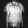
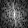

# PRCGAN

## Results Visualization

# Results Visualization

# Results Visualization

| Dataset     | Category    | 0                                      | 1                                      | 2                                      | 3                                      | 4                                      | 5                                      | 6                                      | 7                                      |
|-------------|-------------|----------------------------------------|----------------------------------------|----------------------------------------|----------------------------------------|----------------------------------------|----------------------------------------|----------------------------------------|----------------------------------------|
| **MNIST**   | Magnitude   |  |  |  |  |  |  |  |  |
|             | Fake        |      |      |      |      |      |      |      |      |
|             | Ground Truth|         |         |         |         |         |         |         |         |
| **FMNIST**  | Magnitude   |  |  |  |  |  |  |  |  |
|             | Fake        |      |      |      |      |      |      |      |      |
|             | Ground Truth|         |         |         |         |         |         |         |         |
| **KMNIST**  | Magnitude   |  |  |  |  |  |  |  |  |
|             | Fake        |      |      |      |      |      |      |      |      |
|             | Ground Truth|         |         |         |         |         |         |         |         |
| **EMNIST**  | Magnitude   |  |  |  |  |  |  |  |  |
|             | Fake        |      |      |      |      |      |      |      |      |
|             | Ground Truth|         |         |         |         |         |         |         |         |
